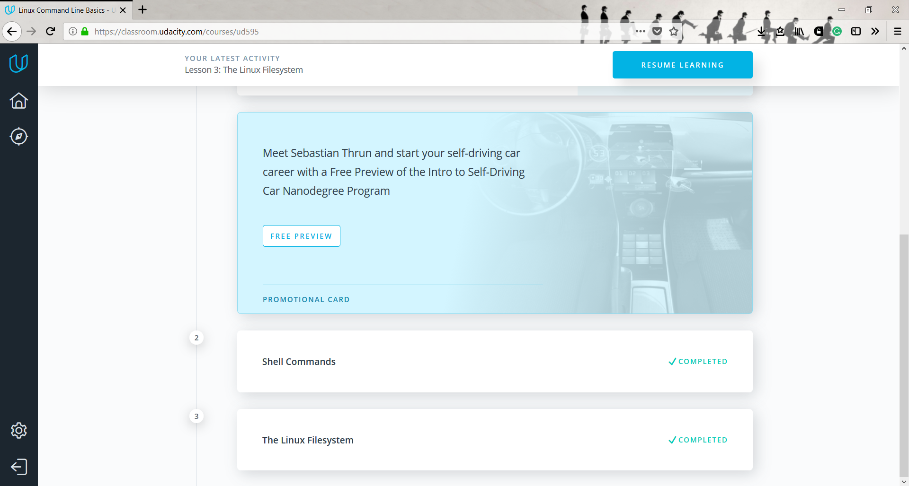
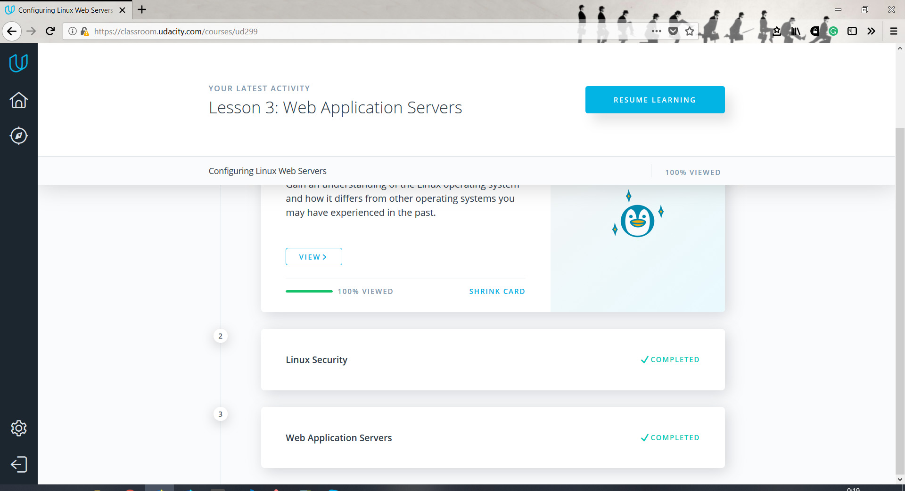

# kottans_frontend

Task 0
-----------
* I don't have experience in computer science, so I've learned all new about Git and GitHub, was pleasantly impressed by the creativity of Sarah and Caroline. Liked Octocats story by CodeSchool, it is very simple and informative.
I am sure that all new information will greatly improve the efficiency of my work.

Task 1
-----------
With Linux command line I was somehow familiar before as Linux-user, but it helped me to structure knowledge. I've realise that I did not use even 5% possibilities of linux command line.
Configuring Linux Web Servers, Networking for Web Developers was totaly new for me, so I have to work on this in future, becourse not all information was clear for me.
Attached screenshots of passed materials:

