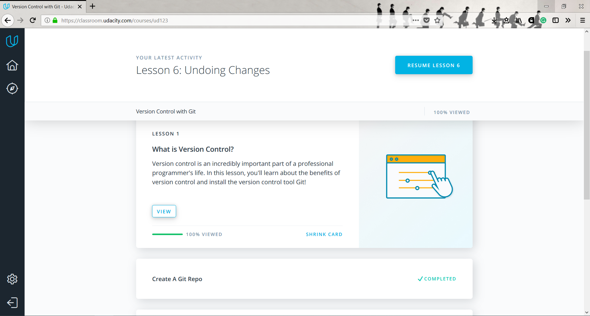

# kottans_frontend

Task 0
-----------
* I don't have experience in computer science, so I've learned all new about Git and GitHub, was pleasantly impressed by the creativity of Sarah and Caroline. Liked Octocats story by CodeSchool, it is very simple and informative.
I am sure that all new information will greatly improve the efficiency of my work.

## Linux CLI, and HTTP
-----------
With Linux command line I was somehow familiar before as Linux-user, but it helped me to structure knowledge. I've realise that I did not use even 5% possibilities of linux command line.
Configuring Linux Web Servers, Networking for Web Developers was totaly new for me, so I have to work on this in future, becourse not all information was clear for me.
Attached screenshots of passed materials:

## Git Collaboration
-----------

Great courses, clear explanation for the better understanding of git!
Attached screenshots of passed materials:

## Intro to HTML and CSS
--------------
It was extremely helpful. This is not the first attempt to study HTML&CSS, but I used to go through online courses, 
where I simply repeated everything after a teacher, and then was difficult to do something by myself. 
Therefore, this training format, where there are specific tasks, brings more results.
Attached screenshots of passed materials:

## Responsive Web Design
--------------

I think a lot of information needs to be worked out, but after these courses, 
I understand how it is important to create responsive websites. 
Attached screenshots of passed materials:
[!Responsive Web Design Fundamentals](task_responsive_web_design/rwdf.png "Responsive Web Design Fundamentals")
[!Flexbox Froggy](task_responsive_web_design/frog.png "Flexbox Froggy")